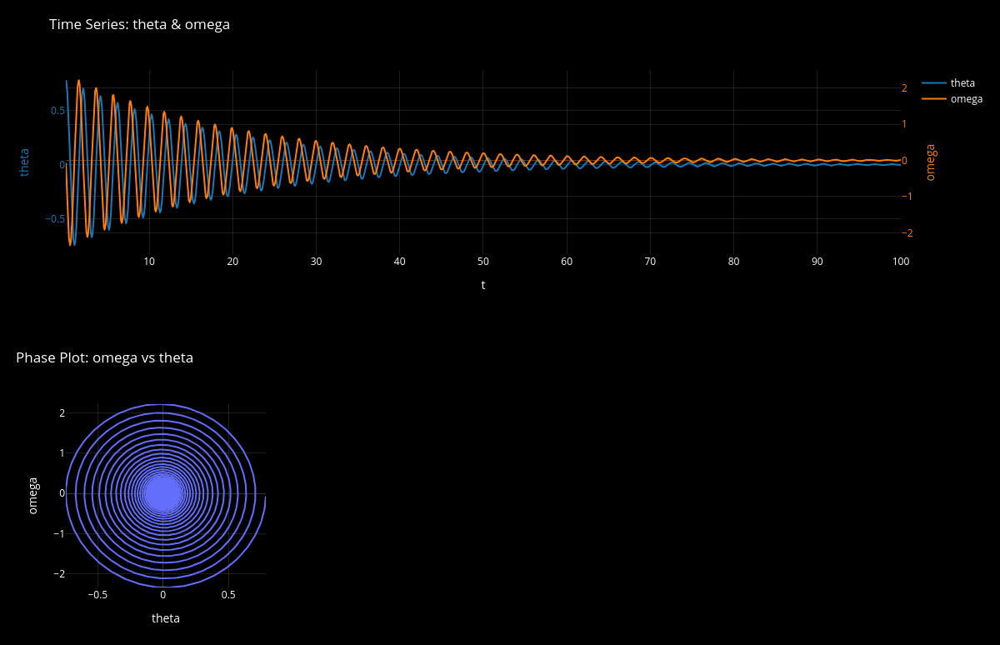

# README — PukahaPai

A dearpygui app for interactiveloy running (simple) ODE system solvers. The aim
is the graduate up to the complexity of an MMT (sectoral balance) Minsky ODES.

## Manifest

**Concept I.**  
The idea is a real economy never collapses except for all 
out war defeat. We are not going to model Geopolitics! Our macroeocnomic 
models are for policy analysis
in times of relative political peace only.


**Concept II.**   
For time series I decided to explicitly and implicitly (yeah both) presume one
should **never care** about long time runs, because any decent nonlinear ODE
will very rapidly depart from any useful real world predictions. This
especially true in Macroeoncomics, which is similar to Weather modelling. _We
only ever care about a short run forecast!_ 


**Concept III.**   
No geopoltics. The model is for (relative)
peace time policy analsysis only. 


## MMT Macroeconomics Considerations

Note to elf: the book I was writing `Monetary_economic_models.pdf` has some
Minsky ODES models and discussions. I have not yet settled on the PukahaPai
modelling specifics. Price, Phillips Curve, and other response functions will be
different. We wan the MMT Phillips Curve to involve deliberate government policy
(inferred from prevailing ideology, or optionally using the MMT BAse Case which
is the JG Buffer, which flattens the Phillips Curve..

**Features to implement:**
1. Stock-Flow consistent, by using Godley Tables.
2. Employment — **noooo NAIRU!**. I want to try some basic government centered model, which really is _always_ a Job Guarantee, but the parameter worst case setting is `neolib` =  JG with zero work, only welfare (basic income).
3. Interest Rate — banks operate on spread. CB rate is policy, but can be a response function to unemployment, since that's present policy, so the regressive basic income. But the MMT Base Case **for comparison** is ZIRP.
4. Prices — probably a dual model. Government prices plus gauge, then market prices.
5. Wages — a special type of price. So also government policy response.
6. Anti-MMT Model — Maybe make it model specific whether the policy target is the Deficit or Full Employment or Inflation. Maye implies Three Model Types.

### Three Base Model Types

**Policy target = Full Employment:** =  MMT Owl Base case.  
**Policy target = Inflation:** =  PPK Dove Base case.  
**Policy target = Deficit/Debt:** =  Neolib Hawk Base case.

#### Policy target = Full Employment:  MMT Owl Base case.  

Use the Levey price model, or Government gauge then Cost + Mark-up. 

#### Policy target = Inflation:   PK Dove Base case.  

GovSpend and or Tax rate adjustments with a lag, in response to rising price level.

#### Policy target = Deficit/Debt:   Neolib Hawk Base case.

GovSpend and or Tax rate adjustments with a lag, in response to rising GovDebt per capita.

**Hypotheses:**  
|  MMT  | PK Dove | Neolib  |
| --- | --- | --- |
| _MMT Base Case is the most stable, with highest productivity and lowest income inequality._ | Low inflation, but higher unemployment, so lower output per capita. | Highest income inequality, lower output per capita.Inflation moderate to low depending on IR. | 
| (Regardless of inflation.) | |  |
|  | |  |


### Simulation Use Case Studies

1. Monte Carlo Studies for NZ — for forecasting. What will unemployment be? What if it were MMT instead?
2. Policy Games — run batch simulations, with designed policy response (a "regime" of government).
3. Intearctive Response Game — use adaptive responses. Thus more varied. The user tries a Deficit Target policy, but then changes to Inflation Target, then to Employment Target.


---

See the [TODO](#todo) section for recent development tasks.

This project is an alternative to my earlier Nim based solver, `pymsky`.  
Main differences:

1. Pymsky was Nim+python with PIPEs for multiprocessing. See `/home/geon/dev/python/economics/pymsky/`.)
2. PukahaPai will use dearpygui + Julia, and try out other multiprocess shared memory options. 
2. I went for a fresh dearpygui and MPI for pukahaPai.

For old dearpygui + Nim solver attempts see `/home/geon/dev/nim/tutorials/dearpygui_nimcontroller/`


Otherwise the basic methodology is the same. For PukahaPai I started
development without the python MMT Sectoral Balance equation preprocessing, and
just dived in with a hard coded Damped Pendulum test case.

## Requirements

Julia and Python3. A few additional pypi packages like 
```bash
pip3 install dearpygui plotly jinja2 tomllib
```
for Julia, packages the `using` directive will prompt to download them if they are not
installed., eg.,
```julia
julia> 
using DifferentialEquations, CSV
```

## Usage

Intend to eventually just have the dearpygui controller run from cmdl,
```bash
python3 pukahaPai.py
```
Everything else will be in default or saved and loadable config files or archived saved models.
Saved models under `./models/` will have past CSV data read back into memory, plus the model 
solver source code in Julia unpacked, current state set to `t[0]` though (we could change 
to `t[-1]` later if that's what we wanted).

# Dev Notes


```
project_root/
├── puhakaPai.py                   # gui controller
├── generate_julia_odesolver.py
└── models/
    ├── pendulum.toml
    ├── pendulum_cmdl.jl
    ├── pendulum_gui.jl    
    └── pendulum.csv             
└── template/
    ├── ode_simsolver_cmdl.jl.template
    └── ode_simsolver.jl.template
```
`pendulum_cmdl.jl   ` is the output from *generate_julia_odesolver.py* run 
with input `pendulum.toml`

`pendulum_gui.jl   ` is the untested version intended for use 
with dearpygui program `pukahaPai`, using shared memory.

Running the model `pendulum` either way should generate a CSV 
file `models/pendulum.csv`.


## Working Dev Versions

No git repo yet, too 'alpha'. Current working version that is crude but ok is
archived as ``./old_stuff/<progname>_<datetime>.working``. 
```
pukahaPai.py_20250722_184402.working
+ related with same timestamp.
```
So do not delete these in the `./old_stuff` archive folder yet, until we 
get a better version.

What works:
* No julia crash from memory issues (though this is never a guarantee).
* Solver "stop" is laggy in the dpg, but no crash.
* dpg plot update seems stable.

What is dodgy:
*  Getting smooth dpg plot animation in realtime is perhaps too much of a hassle, and "who cares"!


## Solver Stability and Other Issues

Sticking with Julia? Anyhow, the stiff ODE systems might arise if we have a
nasty Phillips Curve or other badly programmed response function in the ODES.

### Response Functions Strategy

Macroeocnomics models are our main concern. (What else is there that is important
... that is not climate and ecology related?) 

***Strategy:** Do not write unstable functions!

So we want MMT models that are inherently well-behaved. This may mean some added
runtime. But the idea is to actually use real life stabilizers, built-in. The
idea is a real economy never collapses except for all out war defeat. 
Recall [**Manifest Concept III**](#manifest): we are
not going to model Geopolitics! 

### Short Time Periods

Recall [**Manifest Concept II**](#manifest). This implies we can keep the
plotting simple. I had a window scroll version in mind, but no more! We should
always simply plot from `t=t0` to the last time in the CSV data.

If this compresses the plot display horribly then the user is abusing the 
model. 

If they cannot see a long run instability this way, then "to bad!" You can use
the cmdl versionof the Julia solver to run long times. But remember, long run
stability is not really of much interest, because in Macroeconomics the
poltiical decisions get changed every few years, and with passage of parliament
Bills sometimes within months, and so the model become INVALID after about 6 to
12 months.

That said, long time runs can be useful for long term **policy analysis** —
which is purely theoretical. An academic question, _"what if we ran the system like this for a long time?"_

To visualize such long run simulations I recommend **Save Model** which is the
button that runs the plotly script to make the html report. In a browser you can
windown the time series. You can make your own python script to animate the whole thing
if you care.


### Solver Callbacks

Currently I have,
```julia
cb = DiscreteCallback((u,t,integrator)->true, step_callback)
```
This means the callback is triggered on every internal integration step, which
may happen much more frequently than our time step `dt`.

To force writing only every `dt`, we should use the SavingCallback or a
PreserveCallback that triggers at discrete times. But since you're setting
adaptive=false and `dt=0.01`, we're okay here as long as the solver 
respects `dt`.
Just know this isn't future-proof if we later switch to adaptive mode.


### Solver Options

| Method        | Type                 | When to Use                                           |
| ------------- | -------------------- | ----------------------------------------------------- |
| `Tsit5()`     | Explicit, non-stiff  | Default for most non-stiff ODEs (like your pendulum)  |
| `RK4()`       | Explicit, fixed-step | Educational or when you want a known fixed-order RK, non-stiff   |
| `DP5()`       | Explicit, adaptive   | High accuracy, Dormand-Prince 5 (like MATLAB's ode45) |
| `Vern7()`     | Explicit, high-order | Accurate for long time evolutions                     |
| `Rodas5()`    | Implicit, stiff      | Use for stiff systems (e.g. chemical reactions)       |
| `CVODE_BDF()` | Implicit, stiff      | From Sundials; good for very stiff or complex systems |
| `Euler()`     | Explicit, basic      | Good for teaching or very simple problems             |


### Stiffness 

An ODE is called stiff when it contains components that evolve at very different
time scales — e.g., some variables change very rapidly, while others change very
slowly. This often causes instabilities or inefficient integration with standard
explicit solvers.  A system is stiff when it includes:

- Very fast and very slow dynamics together.
- Extremely different timescales competing.
- Where explicit solvers need very small time steps to remain stable — even when the solution changes slowly.

Think of it like trying to walk calmly while dragging a bouncing spring-loaded
jackhammer on a leash. You don’t need to model the jackhammer's wild
oscillations in full — but if you don’t account for it properly, your simulation
will blow up.

A stiff system has eigenvalues of the Jacobian matrix with very different
magnitudes, typically with some having large negative real parts (fast decay)
and others being small or near zero.

| Symptom                                                        | What You See                                                                                   |
| -------------------------------------------------------------- | ---------------------------------------------------------------------------------------------- |
| 🔥 Explicit solver (like `Tsit5` or `RK4`) becomes *very slow* | You need tiny `dt` to remain stable                                                            |
|  Solution "blows up" with large `dt`                         | Instability due to rapid dynamics                                                              |
|  Long compute times                                          | Solver takes many unnecessary steps to stay accurate                                           |
|  Solver errors like "timestep too small"                     | Often due to stiffness                                                                         |
|  Exponential decay or sharp transients                       | Indicates stiffness (e.g., damping over milliseconds vs other variables evolving over seconds) |


| Domain              | Example                                                 |
| ------------------- | ------------------------------------------------------- |
| Electrical circuits | RC or RLC circuits with small time constants            |
| Chemical kinetics   | Reactions with fast and slow pathways                   |
| Population dynamics | Predator-prey with sharp bursts                         |
| Mechanical systems  | Very high damping or rapid vibrations in a subcomponent |
| Heat conduction     | Problems with large thermal gradients                   |

Imagine the physics: Chemical kinetics, enzyme reactions, electrical circuits
with both inductors and resistors — all tend to have stiffness.

#### Creative Ways to Test for Stiffness

Here are some "scientific hunch-testing" strategies:
-  Plot time constants: Write down your equations and compute the natural timescale of each term. If some decay in 0.0001s and others in 10s — you're likely in stiff territory.
- Auto-detect stiffness in Julia:
```julia
using OrdinaryDiffEq
autodetect = AutoTsit5(Rosenbrock23())
sol = solve(prob, autodetect)
```
This will switch from explicit to stiff solver if stiffness is detected.
-  Run it twice: Use Tsit5() and then Rodas5() or CVODE_BDF(). If the stiff solver runs much faster, it's likely stiff.
- You can simply try solving it with both Tsit5() and Rodas5():
```julia
sol1 = solve(prob, Tsit5(), dt=0.01)
sol2 = solve(prob, Rodas5(), dt=0.01)
```
If Tsit5() takes forever, produces warnings, or gives unstable results, but Rodas5() works fast and accurately → your system is stiff.

Example of a Stiff ODE:
```
dy/dt = -1000y + sin(t)
```
Even though sin(t) changes slowly, the -1000y term forces the solver to 
take tiny time steps to avoid instability — unless you use a stiff solver.


#### What to do if your system is stiff?

Use an implicit or stiff solver, such as:
-  Rodas5() — great default stiff solver in Julia
- TRBDF2() — for moderately stiff systems
- CVODE_BDF() — from the Sundials suite (robust and industry-grade)
- KenCarp4() — for DAE + ODE mixed systems

They allow larger dt and will remain stable even for stiff equations.

### Optional Enhancements (Later)

You could extend our TOML to allow:
```toml
[solver]
method = "Tsit5"
adaptive = false
dt = 0.01
```
And in template:
```julia
sol = solve(prob, {{ method }}(), dt={{ dt }}, adaptive={{ adaptive }}, callback=cb)
```

## Shared Memory (dearpygui)

The program `pukahaPai` is the GUIO controller.  So far I have tested the 
compatible Julia program stills runs ok stand-alone.


## Example — Pendulum

For a pendulum of mass $m$, length $L$, damping coefficient $\gamma$, and
gravitational acceleration $g$, the equations are:
$$
\begin{align*}
\frac{d\theta}{dt} &= \omega \\
\frac{d\omega}{dt} &= -\frac{g}{L} \sin\theta - \gamma \omega
\end{align*}
$$
where $\theta(t)$ is the angular displacement (radians), $\omega(t)$ is the angular velocity.

### Usage Example

```bash
chmod u+x generate_julia_odesolver.py
./generate_julia_odesolver.py pendulum
julia models/pendulum_cmdl.jl
./plots4model.py pendulum
```

Here's a screenshot from the cmdl version output:



## Example — Lorenz Attractor

This model is,
$$
\begin{align*}
x &= \sigma  (y - x) \\
y &= x  (\rho - z) - y \\
z &= x  y - \beta z \\
\end{align*}
$$
The toml config is in `./modles/lorenz_attractor.toml`.

### Usage Example

```bash
./generate_julia_odesolver.py lorenz_attractor
julia models/lorenz_attractor_cmdl.jl
./plots4model.py lorenz_attractor
```


## TODO

[] = not yet done.  
✔ = crudely working, no obvious bugs.  
✔✔ = satisfying and somewhat tested on examples.  
✔✔✔ = rigorously tested (so why still on the TODO list? — because I'm not
totally trusting!).

**Short List:**
* Get basic pendulum example working with GUI.
   - [✔] GUI controller + Julia Solver.
   - [✔] Add a button to "Save Model" which presently should just run the plotly
     html plot script. Later we could add some other form of archiving, like
     saving the Julia script pair plus CSV to a subsubfolder?

* Test the Lorenz Attractor
   - [] Time series plotting ok.
   - [] Add phase plots to dpg??? (Via embedded html, or via PNG?) 

Next: also see the [MMT Considertations section](#mmt-macroeconomics-considerations) above.
* Get a basic MMT Minksy model working on the cmdl
   - [] Maybe try a "dumb" hard coded toml model first?
   - [] Use the Godley table preprocessor, etc., from earlier years, to help
     write the toml spec file.
   - [] Migrate this to the GUI, an advanced feature would be a Godley Table tab
     in dpg? But first see if we can fit enough parameters on the control panel.


**Long Wishlist:**
* Generate full reports? Academic paper-ready.  Should include model summary in
  markdown/katex and even stability analysis reportage.